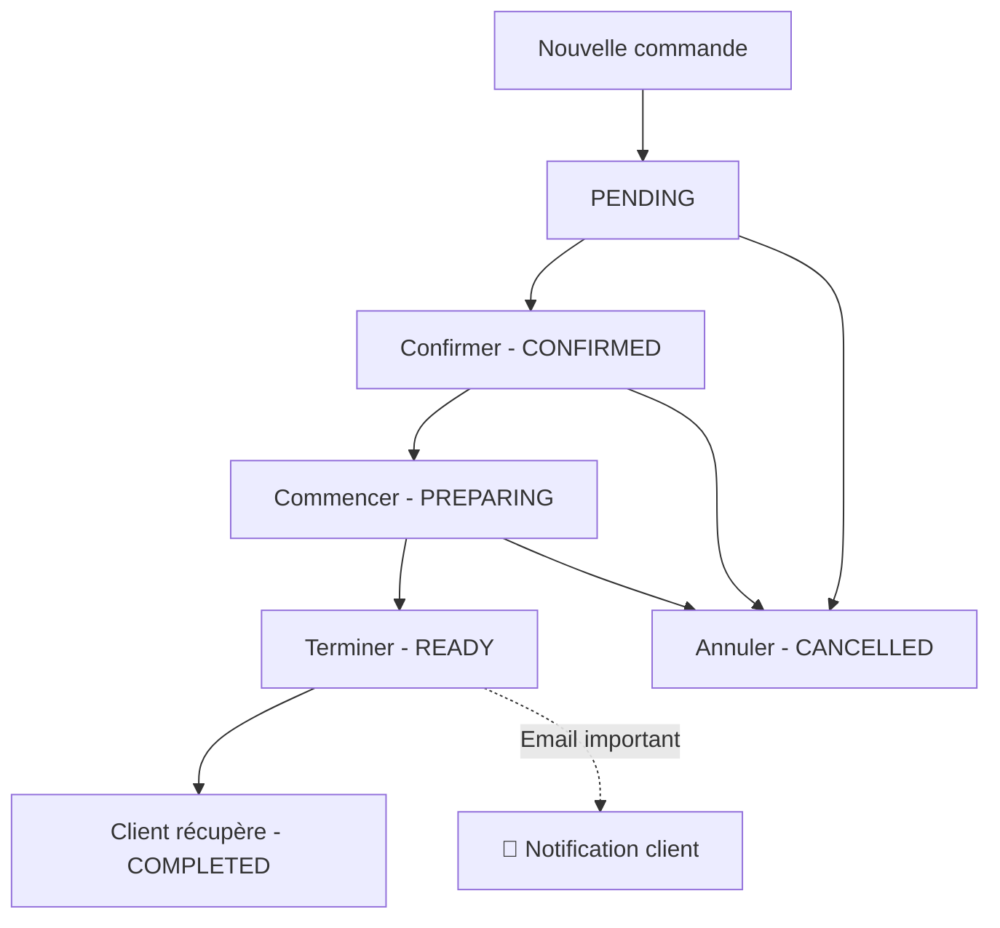

# 📋 Système de Gestion des Commandes

## Vue d'ensemble

Le système de gestion des commandes permet aux boulangers de valider facilement les commandes et d'envoyer des emails de confirmation aux clients. Il comprend :

- **Validation rapide** des commandes avec boutons d'action
- **Envoi d'emails automatique** avec templates professionnels
- **Interface intuitive** pour la gestion des statuts
- **Actions en lot** pour traiter plusieurs commandes

## 🎯 Fonctionnalités principales

### 1. Page de gestion des commandes (`/orgs/[orgSlug]/orders`)

#### Statistiques en temps réel

- Total des commandes
- Commandes en attente
- Commandes en préparation
- Chiffre d'affaires du jour

#### Tableau des commandes

- **Colonnes** : N° commande, Client, Articles, Créneau, Montant, Statut & Actions, Paiement, Date
- **Actions rapides** : Validation directe depuis le tableau
- **Filtrage et recherche** : Recherche par numéro, client, statut
- **Pagination** : Navigation efficace pour de gros volumes

### 2. Page de détail de commande (`/orgs/[orgSlug]/orders/[orderId]`)

#### Informations complètes

- **Détails client** : Nom, email, téléphone (invité ou compte)
- **Articles commandés** : Liste détaillée avec quantités et prix
- **Créneau de retrait** : Date et heure précises
- **Notes** : Instructions spéciales du client

#### Actions de validation

- **Boutons rapides** : Confirmer, En préparation, Prête, Récupérée
- **Sélection personnalisée** : Dropdown avec tous les statuts
- **Envoi d'email** : Option pour notifier le client
- **Feedback visuel** : États de chargement et confirmations

## 📧 Système d'emails

### Configuration

Le système d'email est modulaire et supporte plusieurs providers :

```env
# Configuration dans .env
EMAIL_PROVIDER=console  # console, resend, sendgrid
EMAIL_FROM=noreply@votre-boulangerie.com

# Pour Resend
RESEND_API_KEY=your_resend_api_key

# Pour SendGrid
SENDGRID_API_KEY=your_sendgrid_api_key
```

### Templates d'emails

Les emails incluent :

- **Design responsive** : Optimisé mobile et desktop
- **Branding personnalisé** : Couleurs et nom de la boulangerie
- **Informations complètes** : Détails de la commande et retrait
- **Statut visuel** : Badge coloré selon l'état
- **Instructions claires** : Guidance pour le retrait

### Statuts et notifications

| Statut      | Description        | Email automatique |
| ----------- | ------------------ | ----------------- |
| `PENDING`   | En attente         | ❌                |
| `CONFIRMED` | Confirmée          | ✅ Optionnel      |
| `PREPARING` | En préparation     | ✅ Optionnel      |
| `READY`     | Prête pour retrait | ✅ **Recommandé** |
| `COMPLETED` | Récupérée          | ✅ Optionnel      |
| `CANCELLED` | Annulée            | ✅ Optionnel      |

## 🔧 Architecture technique

### Composants principaux

```
app/orgs/[orgSlug]/(navigation)/orders/
├── page.tsx                           # Page principale des commandes
├── orders-columns.tsx                 # Configuration du tableau
├── orders-data-table.tsx             # Composant tableau
├── _components/
│   └── QuickOrderActions.tsx         # Actions rapides dans le tableau
└── [orderId]/
    ├── page.tsx                      # Page de détail
    ├── _actions/
    │   └── update-order-status.action.ts  # Server action
    ├── _components/
    │   └── OrderStatusActions.tsx    # Actions de validation
    └── _lib/
        └── send-order-email.ts       # Service d'envoi d'emails
```

### Server Actions

#### `updateOrderStatusAction`

```typescript
// Mise à jour du statut avec envoi d'email optionnel
const result = await updateOrderStatusAction({
  orderId: "order_123",
  status: "READY",
  sendEmail: true,
});
```

### Service d'emails

#### `EmailService`

```typescript
// Envoi d'email de confirmation
await EmailService.sendOrderConfirmation({
  to: "client@example.com",
  customerName: "Jean Dupont",
  orderNumber: "CMD-001",
  status: "READY",
  bakeryName: "Les délices d'Erwann",
  htmlContent: emailTemplate,
});
```

## 🚀 Guide d'utilisation

### Pour les boulangers

#### 1. Validation rapide depuis la liste

1. Aller sur la page **Commandes**
2. Cliquer sur le menu **⋯** à droite d'une commande
3. Sélectionner l'action souhaitée :
   - **Confirmer** : Valider la commande
   - **En préparation** : Commencer la préparation
   - **Prête** : Commande prête pour retrait
   - **Récupérée** : Commande retirée par le client

#### 2. Validation détaillée

1. Cliquer sur **Voir les détails** d'une commande
2. Utiliser les **boutons rapides** pour les actions courantes
3. Ou utiliser la **sélection personnalisée** pour plus d'options
4. Cocher **Envoyer un email** pour notifier le client

#### 3. Gestion des emails

- **Automatique** : Emails envoyés selon la configuration
- **Manuel** : Cocher l'option lors du changement de statut
- **Vérification** : Seuls les clients avec email reçoivent les notifications

### Workflow recommandé



## 📱 Interface utilisateur

### Indicateurs visuels

- **Badges colorés** : Statut immédiatement visible
- **Icônes** : Actions clairement identifiées
- **États de chargement** : Feedback pendant les opérations
- **Notifications** : Confirmations des actions réussies

### Responsive design

- **Desktop** : Interface complète avec toutes les fonctionnalités
- **Tablette** : Optimisé pour utilisation en boutique
- **Mobile** : Actions essentielles accessibles

## 🔒 Sécurité et permissions

### Contrôle d'accès

- **Authentification** : Seuls les membres de l'organisation
- **Permissions** : OWNER, ADMIN, MEMBER peuvent gérer les commandes
- **Isolation** : Chaque boulangerie voit uniquement ses commandes

### Validation des données

- **Server Actions** : Validation côté serveur avec Zod
- **Sanitisation** : Nettoyage des entrées utilisateur
- **Rate limiting** : Protection contre les abus

## 📊 Monitoring et analytics

### Métriques disponibles

- **Volume** : Nombre de commandes par période
- **Statuts** : Répartition des états des commandes
- **Performance** : Temps de traitement moyen
- **Revenus** : Chiffre d'affaires en temps réel

### Logs et debugging

- **Console** : Logs détaillés des envois d'emails
- **Erreurs** : Gestion gracieuse des échecs
- **Traçabilité** : Historique des changements de statut

## 🛠️ Configuration avancée

### Personnalisation des emails

Pour modifier les templates d'emails :

1. Éditer `send-order-email.ts`
2. Modifier les styles CSS inline
3. Adapter le contenu selon vos besoins

### Ajout de nouveaux statuts

1. Mettre à jour le schéma Prisma
2. Ajouter les nouveaux statuts dans les composants
3. Créer les templates d'emails correspondants

### Intégration avec d'autres services

Le système est conçu pour être extensible :

- **Webhooks** : Notifications vers des services externes
- **APIs** : Intégration avec des systèmes de caisse
- **Analytics** : Envoi de données vers des outils de suivi

## 🐛 Dépannage

### Problèmes courants

#### Emails non reçus

1. Vérifier la configuration du provider
2. Contrôler les logs de la console
3. Vérifier l'adresse email du client

#### Actions lentes

1. Vérifier la connexion réseau
2. Contrôler les performances de la base de données
3. Optimiser les requêtes si nécessaire

#### Erreurs de permissions

1. Vérifier l'authentification de l'utilisateur
2. Contrôler les rôles dans l'organisation
3. Vérifier l'appartenance à la bonne organisation

### Support

Pour obtenir de l'aide :

1. Consulter les logs de la console
2. Vérifier la configuration des variables d'environnement
3. Tester avec le provider d'email "console" en développement
