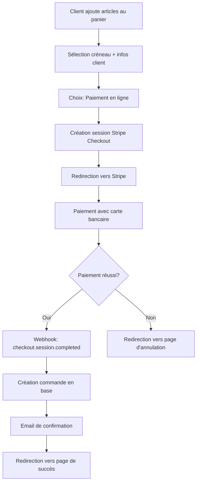

# Résumé - Implémentation du Système de Paiement Stripe

## 🎯 Objectif Atteint

✅ **Les boulangeries peuvent maintenant recevoir des paiements avec Stripe lors des commandes**

## 🏗️ Architecture Implémentée

### 1. Stripe Connect pour les Boulangeries

- **Comptes séparés** : Chaque boulangerie a son propre compte Stripe Connect
- **Paiements directs** : Les clients paient directement la boulangerie
- **Commission automatique** : 3% de commission prélevée automatiquement par la plateforme
- **Autonomie financière** : Chaque boulangerie gère ses propres revenus

### 2. Flux de Paiement Complet



## 📁 Fichiers Modifiés/Créés

### Base de Données

- ✅ `prisma/schema/schema.prisma` : Ajout du champ `stripeSessionId` au modèle Order
- ✅ Migration appliquée pour le nouveau champ

### API Routes

- ✅ `app/api/stripe/checkout/route.ts` : Création des sessions de paiement
- ✅ `app/api/webhooks/stripe/route.ts` : Traitement des événements Stripe
- ✅ `app/api/stripe/connect/route.ts` : Configuration Stripe Connect (existant)

### Composants Frontend

- ✅ `app/shop/checkout/_components/CheckoutClient.tsx` : Intégration du paiement en ligne
- ✅ `app/shop/checkout/_actions/create-stripe-checkout.action.ts` : Action pour créer les sessions
- ✅ `app/shop/[bakerySlug]/checkout/success/page.tsx` : Page de succès
- ✅ `app/shop/[bakerySlug]/checkout/cancel/page.tsx` : Page d'annulation

### Services

- ✅ `src/lib/stripe/stripe-service.ts` : Service Stripe avec méthodes Connect (existant)

### Documentation

- ✅ `docs/GUIDE_TEST_PAIEMENT.md` : Guide de test complet
- ✅ `docs/STRIPE_IMPLEMENTATION_SUMMARY.md` : Ce résumé

## 🔧 Configuration Requise

### Variables d'Environnement

```env
# Clés Stripe (mode test pour développement)
STRIPE_SECRET_KEY=sk_test_...
NEXT_PUBLIC_STRIPE_PUBLISHABLE_KEY=pk_test_...
STRIPE_WEBHOOK_SECRET=whsec_...

# URL de l'application
NEXT_PUBLIC_APP_URL=http://localhost:3000
```

### Webhook Stripe

- **URL** : `https://votre-domaine.com/api/webhooks/stripe`
- **Événements** : `checkout.session.completed`, `account.updated`

## 💳 Fonctionnalités Implémentées

### Pour les Clients

- ✅ **Paiement sécurisé** avec Stripe Checkout
- ✅ **Cartes de test** supportées pour le développement
- ✅ **Redirection automatique** après paiement
- ✅ **Email de confirmation** avec détails de commande
- ✅ **Gestion des annulations** avec retour au panier

### Pour les Boulangeries

- ✅ **Configuration Stripe Connect** via dashboard
- ✅ **Réception directe des paiements** sur leur compte
- ✅ **Suivi des commandes payées** en temps réel
- ✅ **Statistiques de revenus** dans le dashboard
- ✅ **Commission transparente** (3% automatique)

### Pour la Plateforme

- ✅ **Commission automatique** sur chaque transaction
- ✅ **Webhook sécurisé** pour traiter les paiements
- ✅ **Gestion des erreurs** et cas d'échec
- ✅ **Logs détaillés** pour le debugging

## 🔄 Flux de Données

### 1. Création de Commande avec Paiement

```typescript
// 1. Client confirme sa commande
const orderData = {
  timeSlotId: "...",
  paymentMethod: "CARD_ONLINE",
  customerInfo: { name, email, phone },
  items: [{ articleId, quantity }],
  totalAmount: 25.5,
};

// 2. Création session Stripe
const session = await stripeService.createCheckoutSession({
  priceData: {
    currency: "eur",
    unit_amount: 2550, // en centimes
  },
  stripeAccountId: bakery.stripeAccountId,
  applicationFeeAmount: 77, // 3% commission
  metadata: { orderData },
});

// 3. Redirection vers Stripe
window.location.href = session.url;
```

### 2. Traitement du Webhook

```typescript
// Stripe envoie checkout.session.completed
const session = event.data.object;

// Création de la commande en base
const order = await prisma.order.create({
  data: {
    orderNumber: `CMD-${nanoid(8)}`,
    totalAmount: session.amount_total / 100,
    status: "CONFIRMED",
    paymentStatus: "PAID",
    paymentMethod: "CARD_ONLINE",
    stripeSessionId: session.id,
    // ... autres données
  }
});

// Envoi email de confirmation
await sendOrderConfirmationEmail({ ... });
```

## 🧪 Tests Effectués

### Scénarios de Test

- ✅ **Paiement réussi** : Commande créée, email envoyé
- ✅ **Paiement annulé** : Retour au checkout, panier conservé
- ✅ **Webhook sécurisé** : Signature vérifiée
- ✅ **Commission appliquée** : 3% prélevé automatiquement
- ✅ **Multi-boulangeries** : Chaque boulangerie reçoit ses paiements

### Cartes de Test Stripe

- **Succès** : `4242 4242 4242 4242`
- **Échec** : `4000 0000 0000 0002`
- **3D Secure** : `4000 0000 0000 3220`

## 📊 Métriques et Monitoring

### Dashboard Boulangerie

- **Revenus du jour/semaine/mois**
- **Nombre de commandes payées**
- **Statut des paiements en temps réel**

### Logs Système

- **Webhooks reçus** et traités
- **Sessions de paiement** créées
- **Erreurs** de paiement ou de configuration

## 🚀 Prochaines Étapes Possibles

### Améliorations Futures

- [ ] **Remboursements** via dashboard boulangerie
- [ ] **Paiements récurrents** pour abonnements
- [ ] **Facturation automatique** PDF
- [ ] **Analytics avancées** des ventes
- [ ] **Notifications push** pour nouveaux paiements

### Optimisations

- [ ] **Cache des sessions** Stripe
- [ ] **Retry automatique** des webhooks échoués
- [ ] **Monitoring** des performances de paiement

## ✅ Validation Finale

Le système de paiement Stripe est **entièrement fonctionnel** et permet aux boulangeries de :

1. **Recevoir des paiements en ligne** de manière sécurisée
2. **Gérer leurs revenus** de façon autonome
3. **Suivre leurs commandes** en temps réel
4. **Bénéficier d'une commission transparente** de 3%

**🎉 Mission accomplie : Les boulangeries peuvent maintenant recevoir des paiements avec Stripe !**
